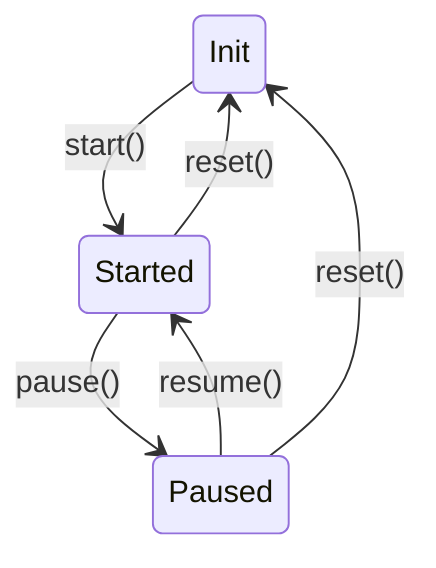

# 学习笔记

## 手势与动画

一般人，眼睛感受到好的动画一般是16毫秒一帧

- 对每一帧的处理
  - setInterval (不推荐：可能会造成栈内内存堆积)
  - setTimeout
  - requestAnimationFrame (新版本浏览器推荐)

[更多关于requestAnimationFrame简称RAF](https://developer.mozilla.org/zh-CN/docs/Web/API/window/requestAnimationFrame)

### TimeLine

表示一个动画从开始到结束的过程,实现动画必要条件

- 主要方法有
  - start 控制动画开始
  - pause 暂停动画
  - resume 继续动画
  - reset 重置动画
  - add 添加动画

### Animation

- Animation 对象负责根据 当前时刻 开始/结束位置 时长 延时来计算并设置要处理的对象

  - object 要处理的对象
  - property 属性
  - startValue 开始位置
  - endValue 结束位置
  - duration 时长
  - delay 延时
  - timingFunction 动画方式
  - template

- 加入暂停和重启

  - 新增 animation.html 和 animation-demo.js, 用 Animation 对象控制 DOM 元素的属性值, 及增加按钮调试 pause, resume
    - 需要在 webpack.config.js 配置中添加新 JS 文件的 entry, 让 webpack 对新文件进行 transpile. 或 html 中以 `type="module"` 方式引入 ESM 模块文件.
    - [Entry Points 参考文档](https://webpack.docschina.org/concepts/entry-points/) - 对每个独立 HTML 文件创建一个 entry
  - 暂停: cancel 上次 RAF 得到的 handle
  - 继续: pause 时记录时间戳; resume 时计算暂停时长; tick 中扣除暂停时长.

- 实现 delay, timingFunction, reset

  - 计算传给 Animation.receiveTime() 的 t 值时, 要减去 delay; t 值为负时不启动, t > 0 时才调用 receiveTime(t)
  - 引入 progress 变量，改为由 timingFunction 负责计算
  - 引入 [Cubic Bezier](https://cubic-bezier.com/) 算法定义的 ease 系列 timingFunction

- Timeline 类引入状态管理
  - 引入 this.state, 各接口方法限定入口状态 (解决了 pause 之后多次 resume 造成回退的问题)

